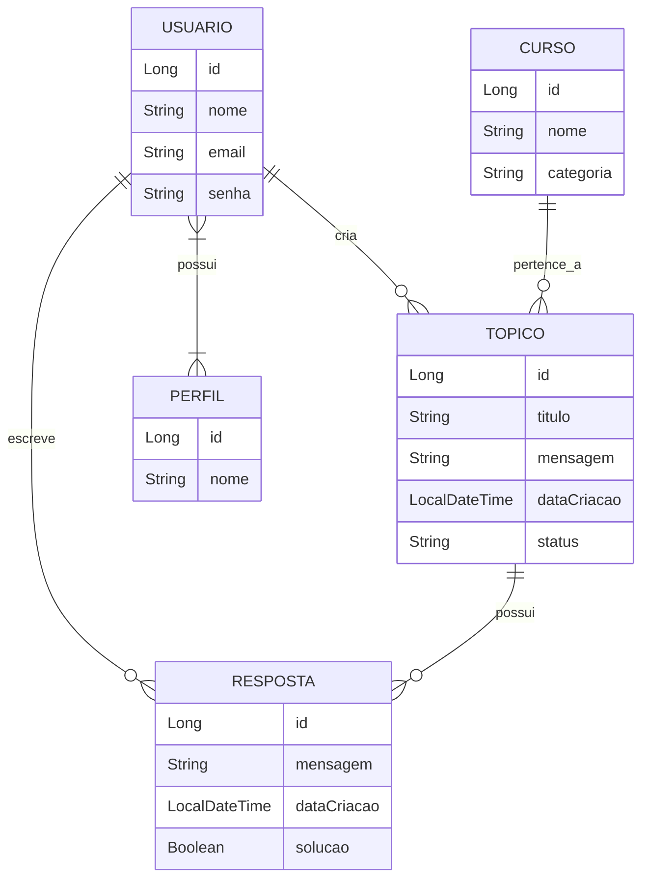

# 📘 Forum Hub - Challenge Alura / Oracle ONE

<p align="center">
  
  
  
  
</p>

## 📝 Descrição

Bem-vindo ao **Forum Hub**! Este projeto é uma API RESTful desenvolvida como parte do desafio Back-end da **Alura** em parceria com a **Oracle ONE (Oracle Next Education)**.

O objetivo é replicar o funcionamento interno de um fórum de discussão, permitindo o cadastro de usuários, criação de tópicos, respostas e autenticação segura via tokens JWT. A aplicação segue as melhores práticas de desenvolvimento, incluindo arquitetura em camadas, validações e tratamento de erros.

## ✨ Funcionalidades

O sistema oferece as seguintes funcionalidades principais:

*   **Autenticação e Segurança**:
    *   Login seguro com email e senha.
    *   Geração e validação de Tokens JWT (JSON Web Token).
    *   Controle de acesso baseado em rotas (Spring Security).

*   **Gestão de Tópicos**:
    *   **Criar Tópico**: Usuários autenticados podem abrir novos tópicos vinculados a um curso.
    *   **Listar Tópicos**: Listagem paginada, com suporte a ordenação e filtros (por nome do curso ou ano).
    *   **Detalhar Tópico**: Visualização dos dados completos de um tópico específico.
    *   **Atualizar Tópico**: Edição de título, mensagem ou status.
    *   **Deletar Tópico**: Remoção de tópicos do banco de dados.

*   **Gestão de Respostas**:
    *   **Responder Tópico**: Adicionar respostas a um tópico existente.
    *   **Listar Respostas**: Visualizar todas as respostas de um tópico específico.
    *   **Editar/Remover Resposta**: Gerenciamento das próprias respostas.

*   **Gestão de Usuários**:
    *   Cadastro de novos usuários.
    *   Atualização de dados de perfil.

## 🛠️ Tecnologias Utilizadas

*   **Java 17**: Linguagem de programação.
*   **Spring Boot 3**: Framework principal para desenvolvimento ágil.
*   **Spring Data JPA**: Camada de persistência de dados.
*   **Spring Security**: Gerenciamento de autenticação e autorização.
*   **Hibernate**: ORM (Object-Relational Mapping).
*   **Maven**: Gerenciamento de dependências.
*   **Lombok**: Redução de código boilerplate.
*   **MySQL**: Banco de dados relacional (recomendado).
*   **Flyway** (Sugerido): Para migrações de banco de dados.

## 📊 Diagrama de Banco de Dados

Abaixo está o diagrama de relacionamento das entidades do sistema:



## 🚀 Como Executar o Projeto

### Pré-requisitos
*   **Java JDK 17** ou superior instalado.
*   **Maven** instalado.
*   **MySQL** rodando localmente (ou configure o `application.properties` para outro banco).
*   IDE de sua preferência (IntelliJ IDEA, Eclipse, VS Code).

### Passo a Passo

1.  **Clone o repositório:**
    ```bash
    git clone https://github.com/seu-usuario/forum-hub.git
    ```

2.  **Configure o Banco de Dados:**
    *   Crie um banco de dados no MySQL chamado `forumhub_api` (ou ajuste no arquivo `application.properties`).
    *   Verifique as credenciais (`spring.datasource.username` e `password`).

3.  **Execute a aplicação:**
    *   Via IDE: Execute a classe `ForumhubApplication.java`.
    *   Via Terminal:
        ```bash
        mvn spring-boot:run
        ```

## 📍 Documentação da API (Endpoints)

Aqui estão alguns dos principais endpoints disponíveis. Recomenda-se usar o **Insomnia** ou **Postman** para testes.

### 🔐 Autenticação

| Método | Endpoint | Descrição | Corpo da Requisição (JSON) |
| :--- | :--- | :--- | :--- |
| `POST` | `/login` | Realiza login e retorna Token JWT | `{"email": "user@email.com", "senha": "123"}` |

### 🗣️ Tópicos

| Método | Endpoint | Descrição |
| :--- | :--- | :--- |
| `POST` | `/topicos` | Cria um novo tópico (Requer Token) |
| `GET` | `/topicos` | Lista todos os tópicos (Paginado) |
| `GET` | `/topicos/{id}` | Detalhes de um tópico |
| `PUT` | `/topicos/{id}` | Atualiza um tópico |
| `DELETE` | `/topicos/{id}` | Remove um tópico |
| `GET` | `/topicos/{id}/respostas` | Lista respostas de um tópico |

**Exemplo de JSON para Criar Tópico:**
```json
{
  "titulo": "Dúvida sobre Spring Security",
  "mensagem": "Como configuro o filtro JWT?",
  "status": "ANDAMENTO",
  "curso": "tecnologia"
}
```

### 💬 Respostas

| Método | Endpoint | Descrição |
| :--- | :--- | :--- |
| `POST` | `/respostas` | Cria uma nova resposta |
| `PUT` | `/respostas/{id}` | Atualiza uma resposta |
| `DELETE` | `/respostas/{id}` | Remove uma resposta |

## 📂 Estrutura de Pastas

```
src/main/java/br/com/alura/forumhub
│
├── controller      # Controladores REST (Endpoints)
│   └── dto         # Data Transfer Objects (DTOs)
├── domain          # Entidades (JPA) e Repositories
│   ├── curso
│   ├── perfil
│   ├── resposta
│   ├── topico
│   └── usuario
├── infra           # Configurações (Security, Exceptions)
└── service         # Regras de Negócio
```

---

<p align="center">
  Desenvolvido por <a href="https://www.linkedin.com/in/seu-linkedin">Seu Nome</a> no programa ONE - Oracle Next Education.
</p>
